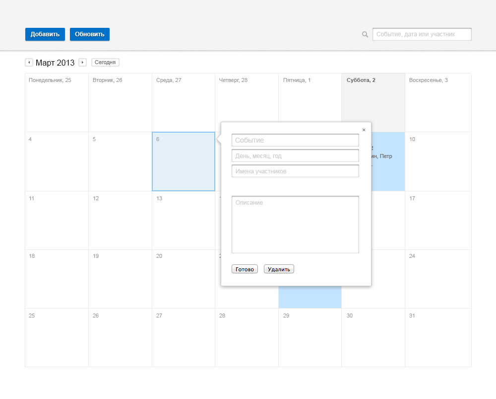

Сверстать страницу календаря в соответствии с макетом ниже.  
Серверной части программировать не надо.  
Необходимо решить задание без использования сторонних JS/CSS-библиотек.

Результат разместите на GitHub и пришлите ссылку на GitHub.

Так же нужно реализовать дополнительную логику для работы календаря:
 * добавление/редактирование событий
 * переход по месяцам
 * поиск
 * сохранение календаря в localStorage

### Примеры дополнительной логики работы

Добавление события

Быстрое добавление события

Просмотр события + редактирование описания

Поиск:

